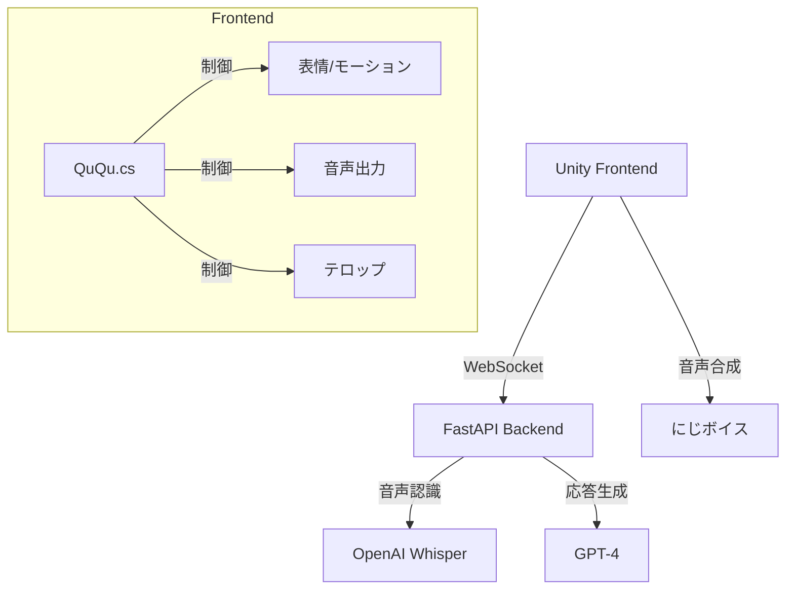

# STS Agent

Unity と FastAPI を利用したストリーミング向けバーチャルアシスタントシステム

## システム概要

STSエージェントは、AIによるリアルタイムな会話と感情表現が可能なバーチャルアシスタントです。
WebSocketを介してバックエンドと通信し、音声認識、テキスト生成、音声合成を行います。

### 主な機能

- リアルタイム音声認識・応答生成
- 感情表現と表情制御
- テキストテロップ表示
- WebSocket経由のリアルタイム通信

## システム構成



### フロントエンド (Unity)

- **コア機能**
  - WebSocketによるバックエンド通信
  - キャラクター制御（表情/モーション）
  - にじボイスによる音声合成
  - テロップ表示

- **主要クラス**
  - `QuQu.cs`: キャラクター制御と音声合成の統合管理
  - `WebSocketClient.cs`: バックエンドとの通信処理
  - `GlobalVariables.cs`: グローバル状態管理
  - `Telop.cs`: テキストテロップ制御

### バックエンド (FastAPI)

- **api.py**: WebSocketエンドポイント
- **agent.py**: AIエージェントのロジック
  - 音声認識（Whisper）
  - 応答生成（GPT-4）
  - 感情解析

## 実装予定の変更点

1. **音声合成システムの移行**
   - AivisSpeech から にじボイス への移行
   - QuQu.cs への音声合成機能の統合
   - 感情表現システムの互換性確保

2. **クラス構造の変更**
   - AivisSpeechCharacter.cs の廃止
   - QuQu.cs へ必要な機能を統合
   - 音声合成インターフェースの抽象化

3. **整合性の確保**
   - WebSocketClient での通信処理の調整
   - 感情表現システムの更新
   - グローバル変数の見直し

## 技術仕様

### 音声合成 (にじボイス)

- APIインターフェース
- 感情表現との連携
- パラメータ制御

### WebSocket通信

- メッセージフォーマット
  ```json
  {
    "content": "発話内容",
    "action": "アクション種別",
    "emotion": "感情状態"
  }
  ```

### 感情表現システム

- 基本感情: normal, happy, angry, sad, surprised, shy, excited, smug, calm
- モーフ制御による表情変更
- アニメーターパラメータとの連携

## 今後の課題

1. にじボイスAPIの実装と統合
2. 音声合成パラメータの最適化
3. エラーハンドリングの強化
4. パフォーマンス検証と改善
