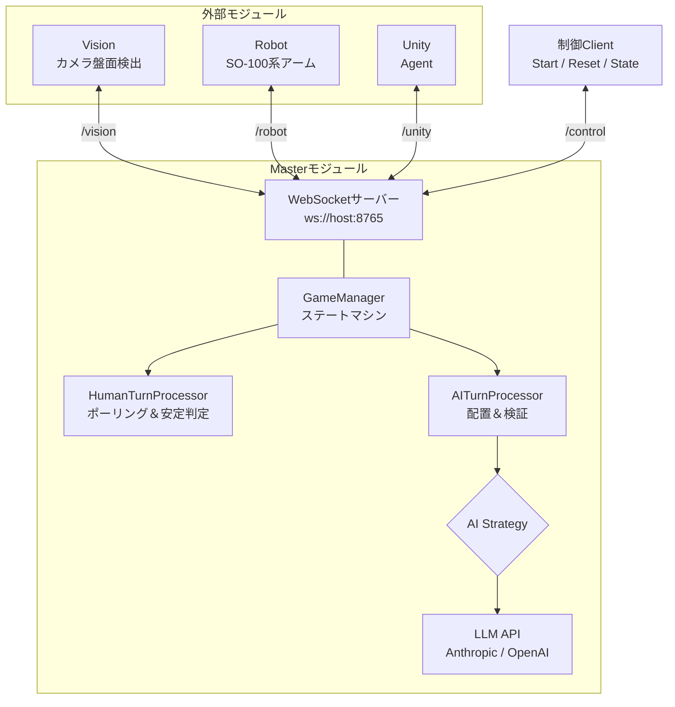
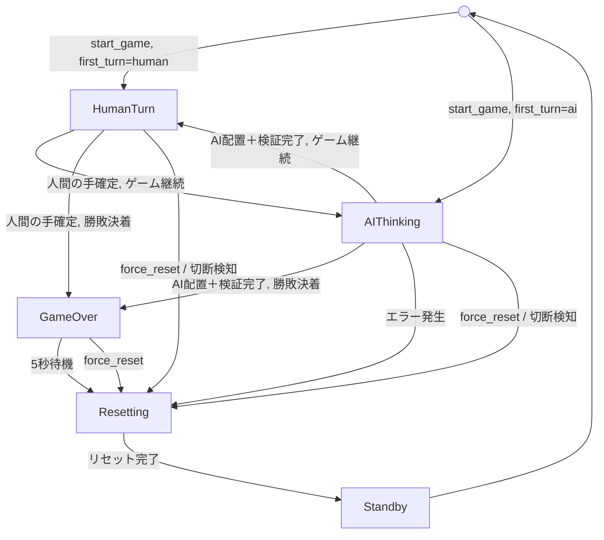
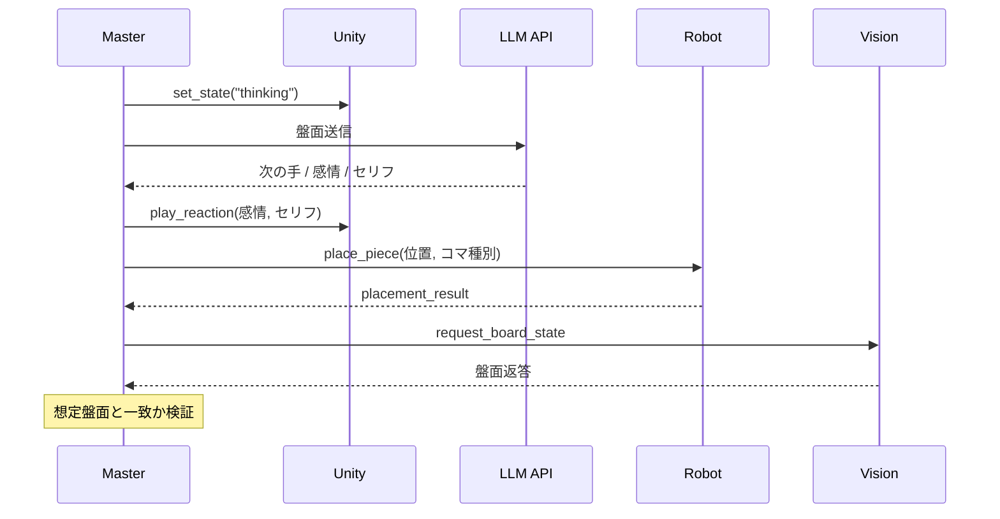
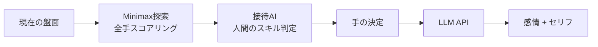
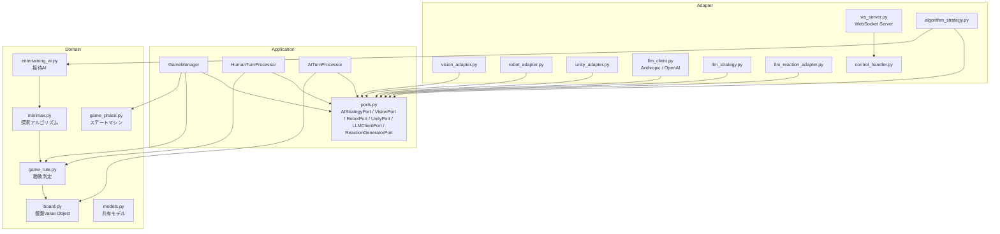

# Masterモジュール

## 1. 起動方法

```bash
uv sync

cp .env.example .env

uv run python -m master
```

## 2. システム全体構成


## 3. 接続方法

各モジュールはWebSocket Clientとして接続し、パスで種別を識別する。

| モジュール | 接続先 | 役割 |
|---|---|---|
| Vision | `ws://host:8765/vision` | 盤面画像認識結果の提供 |
| Robot | `ws://host:8765/robot` | コマの物理配置 |
| Unity | `ws://host:8765/unity` | 3Dキャラクター |
| Control | `ws://host:8765/control` | ゲーム開始・リセット・状態取得 |

## 4. ゲーム進行フロー

### 4.1 ステートマシン



### 4.2 人間のターン（ポーリング監視）

1. Unityへ `set_state: "human_turn"` を送信
2. **1秒間隔**でVisionへ `request_board_state` を送信
3. 受信した盤面が「有効な手」（空きマスに人間のコマが1つだけ追加）かを判定
4. 同一の有効な盤面が**2回連続**で確認できたら「安定」とみなし、手を確定
5. 途中で盤面が変わった場合はカウントをリセットし、監視を継続

### 4.3 AIのターン



### 4.4 勝敗決着時

1. LLMに「ゲーム結果」と「結びのセリフ」を生成させる
2. Unityへ `play_reaction` で演出指示を送信
3. **5秒間**待機（演出時間の確保）
4. Robotへ `reset_robot`、Unityへ `set_state: "idle"` を送信
5. 内部盤面をクリアし、Standbyへ遷移

## 5. 通信メッセージ一覧

### 5.1 対 Vision

| 方向 | type | payload |
|---|---|---|
| Master->Vision | `request_board_state` | `{}` |
| Vision->Master | `board_state_response` | `{"board": [0,1,2,0,1,0,0,0,0]}` |

### 5.2 対 Robot

| 方向 | type | payload |
|---|---|---|
| Master->Robot | `place_piece` | `{"position": 4, "piece_type": 2}` |
| Robot->Master | `placement_result` | `{"success": true, "position": 4, "error_detail": null}` |
| Master->Robot | `reset_robot` | `{}` |

### 5.3 対 Unity

| 方向 | type | payload |
|---|---|---|
| Master->Unity | `set_state` | `{"state": "thinking"}` |
| Master->Unity | `play_reaction` | `{"emotion": "joy", "dialogue": "そこですか!"}` |

**`state` の値:**

| state | 意味 |
|---|---|
| `human_turn` | 人間のターン開始 |
| `thinking` | AI思考中 |
| `error` | エラー発生 |
| `idle` | 待機状態（リセット完了） |

**`emotion` の値:**

| emotion | 意味 | 発生タイミング |
|---|---|---|
| `joy` | 勝利・有利 | AI勝利時、有利な手を打った時 |
| `angry` | 悔しい防御 | 相手のリーチをブロックした時 |
| `sorrow` | 不利・追い詰められた | 劣勢の時 |
| `fun` | 余裕 | 攻めの手を打った時 |
| `neutral` | 様子見 | 序盤 |

### 5.4 制御API

| 方向 | type | payload |
|---|---|---|
| ->Master | `start_game` | `{"first_turn": "human"}` |
| ->Master | `force_reset` | `{}` |
| ->Master | `get_internal_state` | `{}` |
| Master-> | `internal_state_response` | `{"board": [...], "current_phase": "..."}` |

### 5.5 盤面配列

```
[0][1][2]
[3][4][5]
[6][7][8]
```
```
0 = 空き
1 = 人間のコマ(〇)
2 = AIのコマ(✕)
```

人間側正面から見たマッピング、全モジュール共通

## 6. AI Strategy

2つの戦略を実装、envで切り替え可能。

### 6.1 Algorithm Strategy（規定）



- **手の選択**: Minimax アルゴリズムで最適手を計算した上で、人間のスキルに応じて強さを調整
  - 人間が上手く打っている -> 弱めの手を選び、人間に勝機を与える
  - 人間がミスした -> 最善手で咎める
  - 即勝ちできる場面 -> 必ず勝つ
  - 人間リーチ -> ブロック
- **感情・セリフ**: LLM が盤面状況を解釈して生成
  - Anthropicの方が盤面にあった会話に見える。OpenAIは常にJoyの傾向あり

### 6.2 LLM Strategy

- 手・感情・セリフの全てをLLMに委ねる
- LLMの盤面認識力に依存するため、ブロック漏れ等の発が多い(人間が勝ちやすいが、戦っている感じもない。より高性能なモデルを使えば精度は上がるが、レイテンシも大きくなる)

### 6.3 LLMプロバイダー

Anthropicと OpenAI に対応、`.env` で切り替え可能。

## 7. エラーハンドリング

### 7.1 タイムアウト

| 対象 | タイムアウト | リトライ | タイムアウト後の挙動 |
|---|---|---|---|
| Vision盤面要求 | 1秒 | 最大3回 | エラー -> リセット |
| LLM推論要求 | 10秒 | 最大3回 | フォールバック（ランダム手＋定型セリフ） |
| Robot配置指示 | 30秒 | なし | エラー -> リセット |

### 7.2 LLMフォールバック

LLMが3回リトライしても有効な応答を返せない場合:
- 手: 空きマスからランダムに選択
- 感情: `neutral`
- セリフ: 定型文
```python
FALLBACK_DIALOGUES: list[str] = [
    "なるほど、ではこちらにしましょう",
    "うーん、ここかな",
    "よし、決めました",
]
```

### 7.3 エラー発生時の挙動

1. Unityへ `set_state: "error"` を送信
2. Robotへ `reset_robot` を送信
3. Unityへ `set_state: "idle"` を送信
4. 内部状態をStandbyへ遷移

### 7.4 WebSocket切断時

対局中にRobot, Vision, Unityのいずれかが切断された場合、即座にエラー->リセット処理を実行します。

## 8. 設定一覧

`.env` ファイルで全設定を管理。

| 環境変数 | デフォルト | 説明 |
|---|---|---|
| `ANTHROPIC_API_KEY` | (なし) | Anthropic API Key |
| `OPENAI_API_KEY` | (なし) | OpenAI API Key |
| `MASTER_AI_STRATEGY` | `algorithm` | AI Strategy (`algorithm` / `llm`) |
| `LLM_PROVIDER` | `anthropic` | LLMプロバイダー (`anthropic` / `openai`) |
| `LLM_MODEL` | プロバイダー依存 | LLMモデル名 |
| `MASTER_HOST` | `0.0.0.0` | WebSocketホスト |
| `MASTER_PORT` | `8765` | WebSocketポート |
| `MASTER_VISION_TIMEOUT` | `1.0` | Vision タイムアウト(秒) |
| `MASTER_ROBOT_TIMEOUT` | `30.0` | Robot タイムアウト(秒) |
| `MASTER_LLM_TIMEOUT` | `10.0` | LLM タイムアウト(秒) |
| `MASTER_POLL_INTERVAL` | `1.0` | ポーリング間隔(秒) |
| `MASTER_STABLE_COUNT` | `2` | 安定判定の連続回数 |
| `MASTER_GAME_OVER_WAIT` | `5.0` | 勝敗決着後の待機時間(秒) |

## 9. テスト

### 9.1 自動テスト (77テスト)

pytestによる自動テストで、要件定義の全シナリオをカバーしています。

| 要件シナリオ | テストファイル | テスト数 |
|---|---|---|
| 1. 正常系フルゲーム | `test_normal_game.py` | 2 |
| 2. ポーリング安定判定 | `test_human_polling.py` + `test_human_turn.py` | 10 |
| 3. AI配置後エラー | `test_ai_verification.py` | 4 |
| 4. LLMリトライ＆フォールバック | `test_llm_fallback.py` | 12 |
| 5. タイムアウト・切断・リセット | `test_timeout_disconnect.py` | 7 |
| Domain層ユニットテスト | `test_board.py` `test_game_rule.py` `test_minimax.py` `test_entertaining_ai.py` | 39 |
| AIターンユニットテスト | `test_ai_turn.py` | 3 |

実行方法:
```bash
uv run pytest tests/ -v
```

### 9.2 シミュレータ

WebSocket経由でフルシステムを模擬するインタラクティブなシミュレータである。
Vision/Robot/UnityのMock ClientがWebSocketで接続し、ターミナル上で実際にゲームをプレイできる。

実行方法:
```bash
uv run python -m simulator
```

```
===========================
    〇✕ゲーム シミュレータ
===========================

マス番号:
 0  | 1  | 2
----+----+----
 3  | 4  | 5
----+----+----
 6  | 7  | 8

先手を選択 [h]uman / [a]i (default: human): h

あなたの番です (0,1,2,3,4,5,6,7,8): 4

AI思考中...
AI [neutral]: 「中央を取られたか。まずは様子を見よう。」
```

## 9. アーキテクチャ

Hexagonal Architectureに基づき、依存は常に内側（Domain）に向く。


