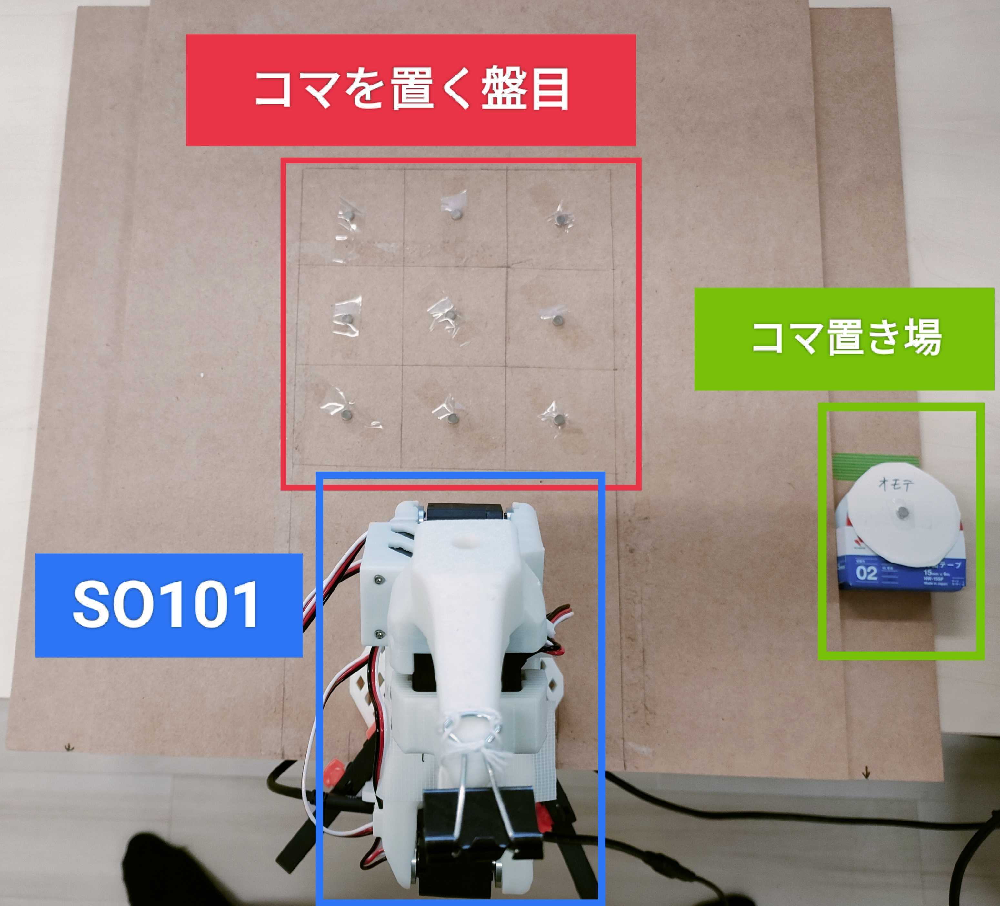

# 盤面の概要図
<p align="center">
  
</p>

main.py内のdataset.repo_idを書き換えることで再生する軌道を変更することができます。厳密な盤面の設計情報については省略するので、各自の盤面の寸法に合わせて、データを取り直してください。

# LeRobot セットアップ

```
git clone https://github.com/huggingface/lerobot.git
cd lerobot

conda create -y -n lerobot python=3.10
conda activate lerobot

conda install ffmpeg=7.1.1 -c conda-forge
pip install -e .
pip install -e ".[feetech]"
```


# ロボットのキャリブレーション

## フォロワーロボット

```
lerobot-calibrate \
    --robot.type=so101_follower \
    --robot.port=/dev/tty〇〇 \
    --robot.id=〇〇
```

## リーダーロボット

```
lerobot-calibrate \
    --teleop.type=so101_leader \
    --teleop.port=/dev/tty〇〇 \
    --teleop.id=〇〇
```

# Hugging Face にログイン

```
pip install huggingface_hub

huggingface-cli login
```

# データの記録と再生

```
lerobot-record \
  --robot.type=so101_follower \
  --robot.port=/dev/tty〇〇 \
  --robot.id=〇〇 \
  --teleop.type=so101_leader \
  --teleop.port=/dev/tty〇〇 \
  --teleop.id=〇〇 \
  --dataset.repo_id=<user>/pick_place_fixed \
  --dataset.num_episodes=9 \
  --dataset.single_task="Pick from A and place to B" \
  --dataset.episode_time_s=10 \
  --dataset.reset_time_s=5
```


```
lerobot-replay \
  --robot.type=so101_follower \
  --robot.port=/dev/tty〇〇 \
  --robot.id=〇〇 \
  --dataset.repo_id=<user>/pick_place_fixed \
  --dataset.episode=0
```

# コードの説明

## ライブラリの追加
```
pip install fastapi uvicorn websockets
```

## test.py
・クライアントとして, 以下のjsonを送信する

```
{
"type": "place_piece",
"payload": {
    "position": int,
    "piece_type": int
    }
}
```

## main.py
・リクエストを受け取って`lerobot-replay` コマンドを実行し, 以下のjsonを返す

```
{
"type": "placement_result",
"payload": {
    "success": True,
    "position": int,
    "error_detail": string
    }
}
```

## 注意事項
・main.py内のrobot.port, robot.id, dataset.repo_idは適宜書き換えてください